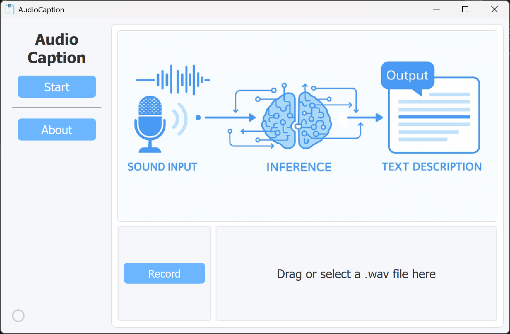

# Audio Caption

## 0. Basic introduction of Audio Caption

This is a program with a pretrained audio model. This model trains Llama and CNN14 on the Clotho dataset for 20,000 steps. And selected step=10,000 as the final model.

 

It can infer the environmental sound uploaded by recording or from your local files, and output a simple description of the sound you uploaded.



## 1. Install dependencies

```bash
# Clone the repo
git clone https://github.com/YoungSkyX/SURF2025_AudioCaption.git
cd SURF2025_AudioCaption

# Install Python environment
conda create --name audio_caption_withGUI python=3.10

# Activate environment
conda activate audio_caption_withGUI

# Install dependencies
pip install numpy==2.2.1
pip install tqdm==4.67.1
pip install wandb==0.19.1
pip install pandas==2.2.3
pip install librosa==0.10.2
pip install torchaudio==2.5.1
pip install pretty_midi==0.2.10
pip install panns_inference==0.1.0
pip install transformers==4.47.1
pip install audidata
pip install PyQt6
pip install pyaudio
pip install torch torchvision torchaudio --index-url https://download.pytorch.org/whl/cu118   # Make sure that you have correct cuda version >=118
```

> And you may need to download a pretrained model at [Cnn14_mAP=0.431.pth](https://zenodo.org/records/3987831/files/Cnn14_mAP=0.431.pth) and [class_labels_indices.csv](https://github.com/IBM/audioset-classification/blob/master/audioset_classify/metadata/class_labels_indices.csv) manually if you do not have it at C:/Users/(your name)/panns_data


## 2. Train a model

If you want to train the model again, simply download datasets such as [Clotho](https://zenodo.org/records/3490684). Then edit the path in `train.py` to `root=your_local_datasets_root`.

If you want to change the model, for example to [QWen-Audio](https://huggingface.co/Qwen/Qwen-Audio/blob/main/modeling_qwen.py), get the model config file and modify it similar to `llama.py` in the `models` folder. Then update the relevant code in `train.py`.

After activating the environment, run the following command in `/SURF2025_AudioCaption/` to train the model:

```bash
python train.py
```

After training a new model, change `ckpt_path = "inference\\step=10000.pth"` in `inference.py` to ensure this program uses the new model for inference.

For this repository, `step=10000.pth` is the Llama and CNN14 model checkpoint generated by running `train.py` on an RTX 4090.

## 3. Run this GUI

After activating the environment, run the code below in `/SURF2025_AudioCaption/` to launch this interface.

```bash
python GUI.py
```

For the first input, it may take a bit more time.

## External Link

This project is based on https://github.com/qiuqiangkong/mini_audio_caption.